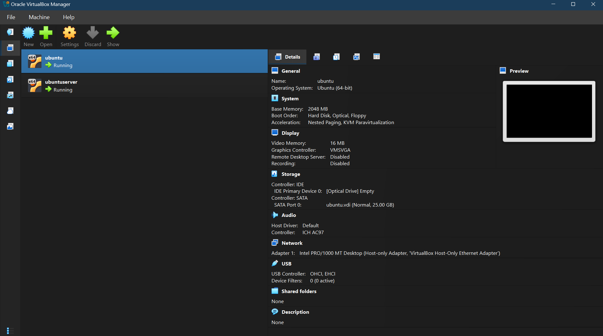
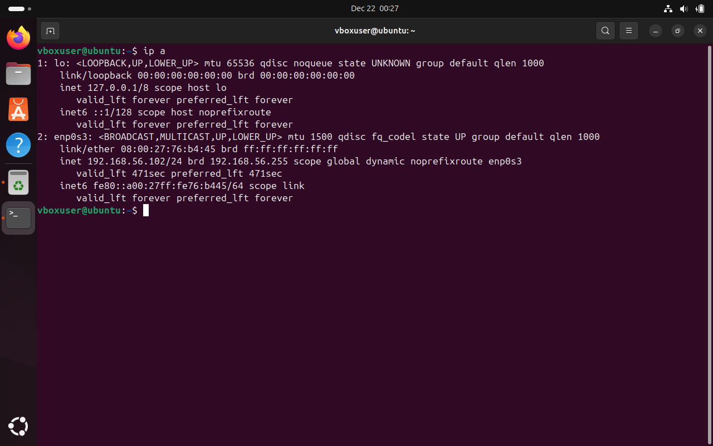
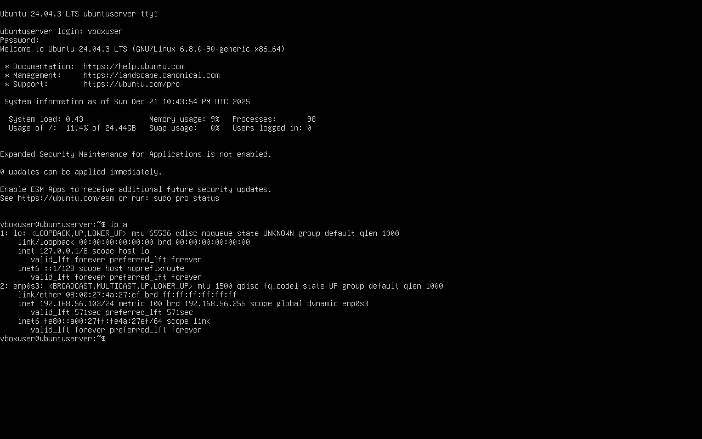
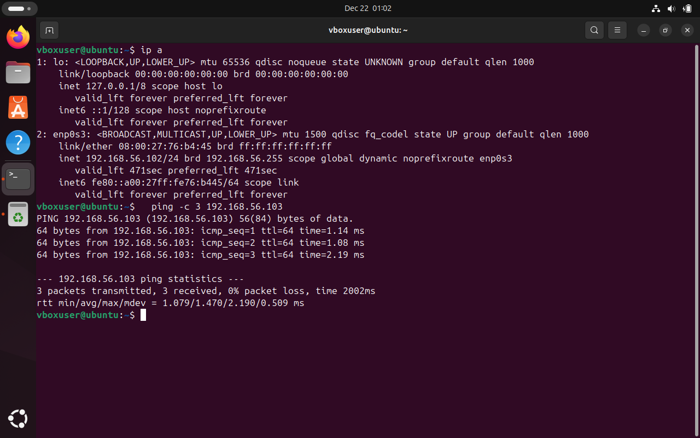

# Week 1 – Virtual Machine Setup and Network Configuration

**Module:** CMPN202 – Operating Systems  
**Student Name:** Niraj Kumar Sah  
**Student ID:** A00023606  

## Objective
The objective of Week 1 was to install and configure two virtual machines (Ubuntu Workstation and Ubuntu Server) using Oracle VirtualBox and to establish network connectivity between them.

## Virtual Machine Setup
Two virtual machines were created using Oracle VirtualBox:
- Ubuntu Workstation (GUI-based)
- Ubuntu Server (CLI-based)

Both operating systems were installed successfully.

## Network Configuration
Both virtual machines were configured with a **Host-only Adapter** to allow internal communication between the workstation and the server.

- Network Adapter: Host-only Adapter  
- IP Address Range: 192.168.56.0/24  
- IP addresses were assigned dynamically via DHCP

## Connectivity Testing
Connectivity between the workstation and the server was tested using the `ping` command:

bash
ping <server-ip>

Successful ping responses confirmed that the two virtual machines were connected correctly.

SSH connectivity to the Ubuntu Server was also verified.

## Evidence (Screenshots)

### VirtualBox Virtual Machines

### Workstation IP Address

### Server IP Address

### Workstation to Server Ping

### SSH Connection to Server

## Conclusion
Both the Ubuntu Workstation and Ubuntu Server were successfully installed, configured, and connected using a Host-only network adapter. Network communication between the two systems was verified successfully.

