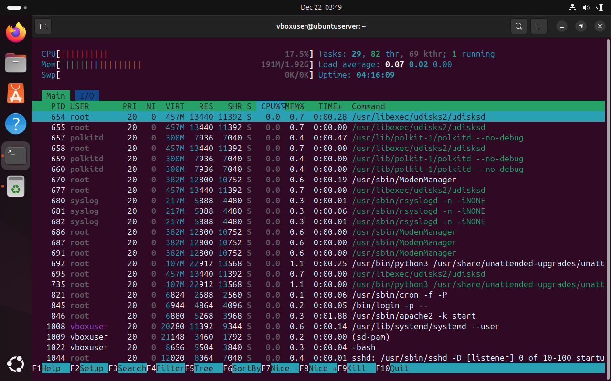
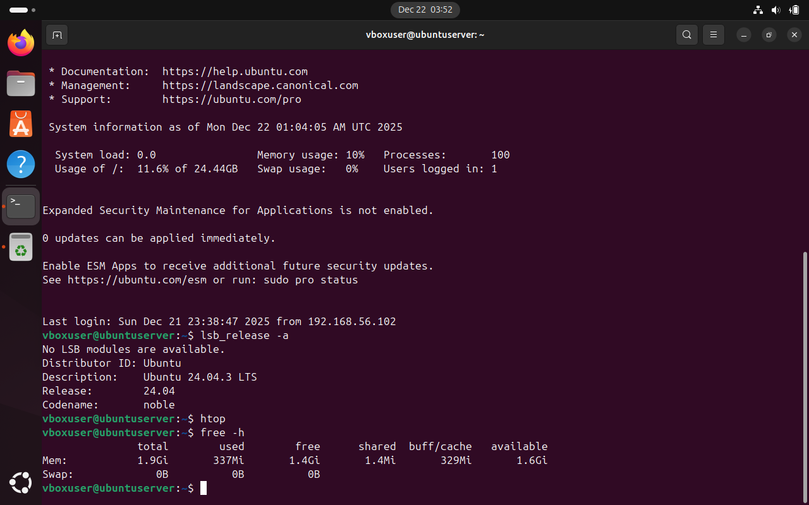
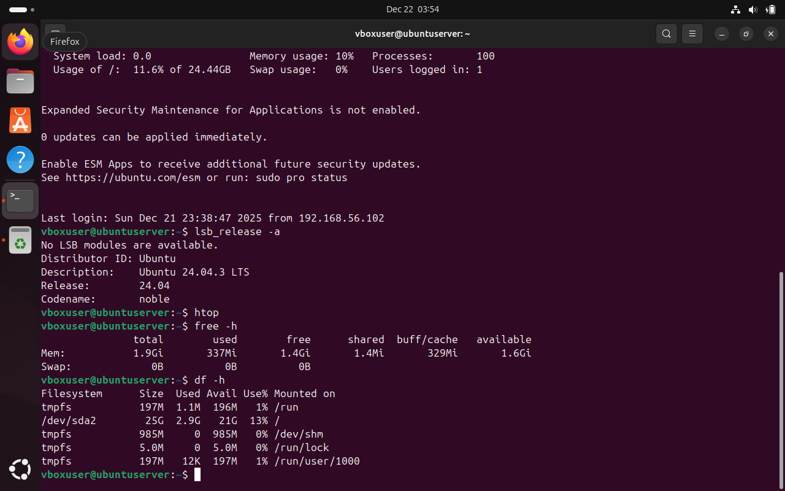
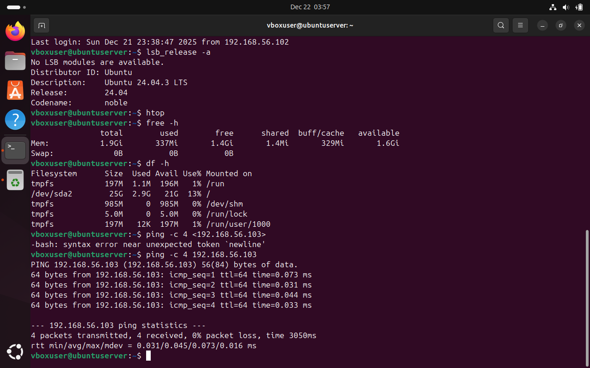

# Week 3 – Application Selection for Performance Testing

**Module:** CMPN202 – Operating Systems
**Student Name:** Niraj Kumar Sah
**Student ID:** A00023606

# Aim of the Week

The aim of Week 3 was to identify and select appropriate system applications and tools for performance testing on a Linux-based operating system. Performance testing is essential to ensure that system resources such as CPU, memory, disk, and network are operating efficiently and can support real-world workloads.

# System Environment

The environment used for this task consisted of:
**Operating System:** Ubuntu 24.04 LTS
**Platform:** Oracle VirtualBox
System Type: Ubuntu Server and Ubuntu Workstation
Network Type: Host-only Adapter
This setup reflects a realistic client–server environment suitable for performance evaluation.

# Selected Performance Testing Tools

The following Linux tools were selected based on reliability, availability, and suitability for performance monitoring:

# 1. htop

htop is an interactive process viewer used to monitor:

CPU usage per core

Memory and swap usage

Running processes in real time

It provides a clearer and more user-friendly interface compared to traditional tools like top.

# 2. free

The free command displays system memory usage, including:

Total memory

Used and available memory

Swap usage

This tool is lightweight and useful for quick memory analysis.

# 3. df

The df command reports disk space usage for mounted file systems. It helps in identifying:

Disk capacity

Available space

File system usage percentage

# 4. ping

ping was used to test network responsiveness and latency between the Ubuntu Workstation and Ubuntu Server.

Commands Used

The following commands were executed on the Ubuntu system:

htop

free -h

df -h

ping <server-ip>

These commands provided real-time insight into system performance across CPU, memory, disk, and network components.

# Results and Observations

CPU usage remained stable under normal operation, with no abnormal spikes observed.

Memory usage showed sufficient available RAM, indicating efficient resource allocation.

Disk usage was within acceptable limits, with ample free space available.

Network latency between the workstation and server was low, confirming reliable connectivity.

These results demonstrate that the system is capable of handling standard workloads effectively.

# Evidence (Screenshots)

Screenshots were captured to support the analysis and are stored in the following directory:

### CPU and Memory Monitoring (htop)

### Memory Usage

### Disk Usage

### Network Performance Test

# The evidence includes:

htop output showing CPU and memory usage

free command output

df command output

ping test results

# Conclusion

This week successfully demonstrated the selection and use of appropriate Linux tools for performance testing. The chosen applications provided clear visibility into system resource usage and confirmed that the Ubuntu environment is stable and suitable for further testing and deployment. Understanding these tools is essential for maintaining system reliability and performance in real-world scenarios.
