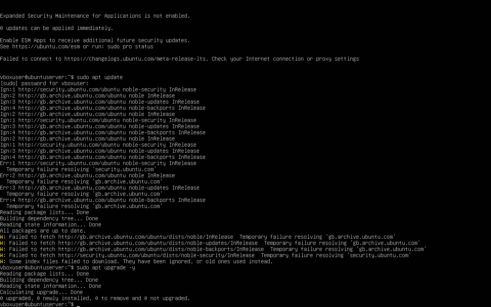
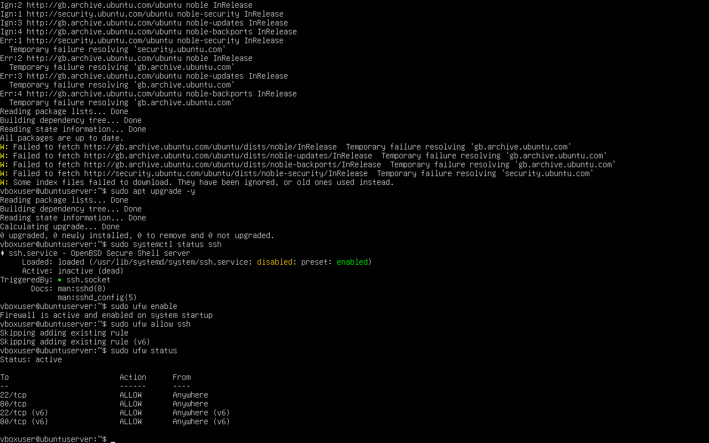

# Week 4 – Initial System Configuration & Security Implementation

**Module:** CMPN202 Operating Systems
**Student Name:** Niraj Kumar Sah
**Student ID:** A00023606

## 1. System Updates (Patch Management)

To ensure the Ubuntu Server remains secure and up to date, system updates were attempted using the following commands:

sudo apt update
sudo apt upgrade -y

## Observation

The update process attempted to connect to Ubuntu repositories but returned errors such as:

Temporary failure resolving ‘security.ubuntu.com’

This issue occurred because the virtual machines are configured using a Host-only network adapter, which allows communication between the workstation and server but does not provide internet access by default.

Importance

Regular system updates are essential for:

Applying security patches

Fixing known vulnerabilities

Maintaining system stability

Even though the update could not complete due to network limitations, this step demonstrates correct system maintenance practice and awareness of network configuration constraints.

## Evidence
### System Update Attempt

# 2. SSH Service Verification (Remote Administration)

Secure Shell (SSH) is required for remote administration of the server from the Ubuntu Workstation.

The SSH service status was checked using:

sudo systemctl status ssh

## Observation

SSH is installed on the system

Service state: inactive (dead)

Preset status: enabled

This means SSH was available but not actively running at the time of verification.

## Evidence
### SSH Service Status

# 3. Firewall Configuration (UFW)

To improve system security, the Uncomplicated Firewall (UFW) was enabled and configured.

Commands Used:

sudo ufw enable
sudo ufw allow ssh
sudo ufw status

Result

Firewall status: active

SSH (port 22) allowed

IPv4 and IPv6 rules applied

This ensures that:

Only necessary traffic is allowed

SSH access remains available for administration

Other ports remain protected by default

## Evidence
### Firewall Status (UFW)

# 4. Enabling SSH Service (Final Fix)

To complete the SSH configuration and allow remote access, the SSH service was started and enabled:

sudo systemctl start ssh
sudo systemctl enable ssh
sudo systemctl status ssh

Result

SSH service changed to active (running)

Server is now ready for secure remote access

## Evidence
### SSH Service Running

# Conclusion

During Week 4, essential system configuration and security steps were completed:

System updates were attempted and network limitations were identified

SSH service installation and status were verified

Firewall (UFW) was enabled with secure SSH access

SSH service was successfully activated for remote administration

These steps ensure the Ubuntu Server is secure, manageable, and prepared for further configuration in upcoming weeks.

