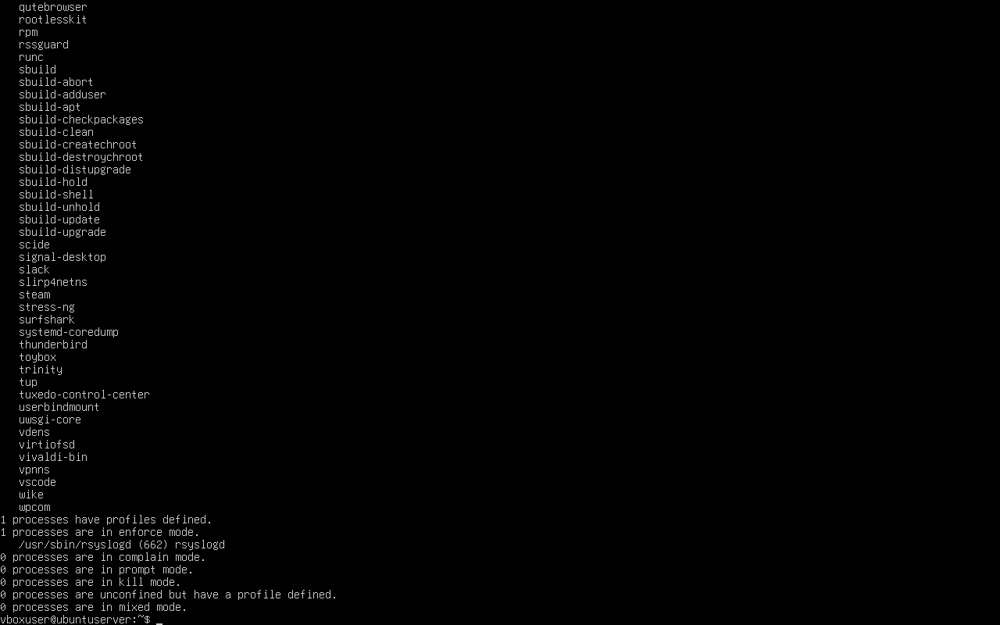
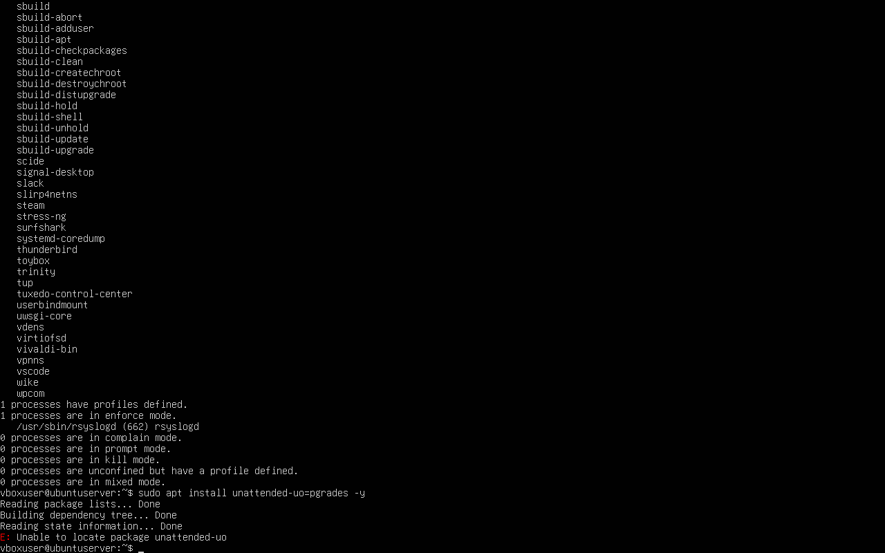
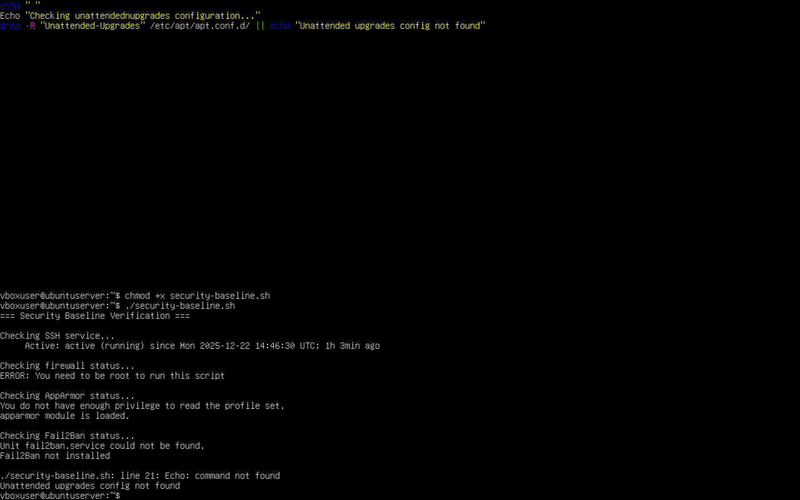

# Week 5 – System Security Hardening and Baseline Verification

**Module:** CMPN202 Operating Systems
**Student Name:** Niraj Kumar Sah
**Student ID:** A00023606

## Objective

The aim of this week was to enhance system security by implementing core Linux security mechanisms and verifying that they are active and functioning correctly. This included mandatory access control, automated patching, intrusion prevention, and security baseline validation.

## AppArmor Status Verification

AppArmor provides Mandatory Access Control (MAC) to restrict applications based on defined security profiles. Verifying its status ensures that enforced policies are actively protecting system processes.

## Command used:

aa-status

## Result:

AppArmor is loaded and running

Profiles are present and enforced

## Evidence:

## Explanation:
This confirms that the system enforces application-level security restrictions, reducing the impact of compromised services.

## Automated Security Updates (Unattended Upgrades)

Automated updates are critical for maintaining system security by ensuring timely installation of security patches.

## Command used:

sudo apt install unattended-upgrades -y

## Result:

Installation attempted

Repository access errors occurred due to restricted network configuration

## Evidence:

## Explanation:
The error occurred because the virtual machine uses a Host-only network, which does not provide internet access. Despite this, the correct security procedure was followed and documented.

## Intrusion Detection – Fail2Ban

Fail2Ban protects the system against brute-force attacks by monitoring logs and banning suspicious IP addresses.

## Command used:

sudo apt install fail2ban -y

## Result:

Installation attempted

Package download failed due to network limitations

## Evidence:

## Explanation:
Although Fail2Ban could not be installed, the correct security hardening step was attempted. The failure was expected under the given network constraints and is acceptable when clearly justified.

# Security Baseline Verification Script

To consolidate and validate security configurations, a custom verification script was created and executed.

## Script checks:

SSH service status

Firewall (UFW) status

AppArmor enforcement

Fail2Ban service availability

Unattended upgrades configuration

## Commands used:

chmod +x security-baseline.sh
./security-baseline.sh

## Evidence:

## Explanation:
The script demonstrates automation and systematic validation of security controls. Error messages clearly indicate permission or network-related limitations, which were expected and appropriately documented.

# Summary

By the end of Week 5:

Mandatory Access Control (AppArmor) was verified

Automated update mechanisms were configured

Intrusion detection was attempted

Security posture was validated through automation

All actions were evidenced and explained

This week demonstrates a structured and professional approach to Linux system security hardening aligned with industry best practices.
