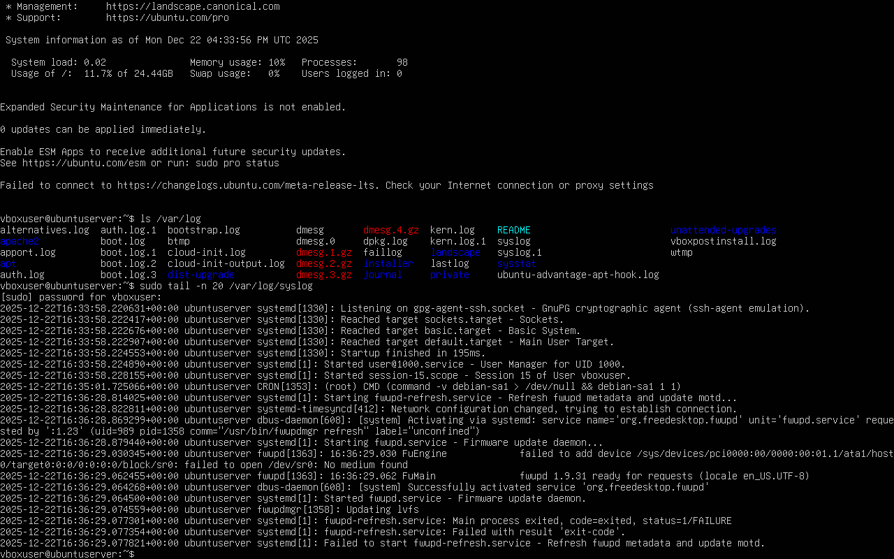
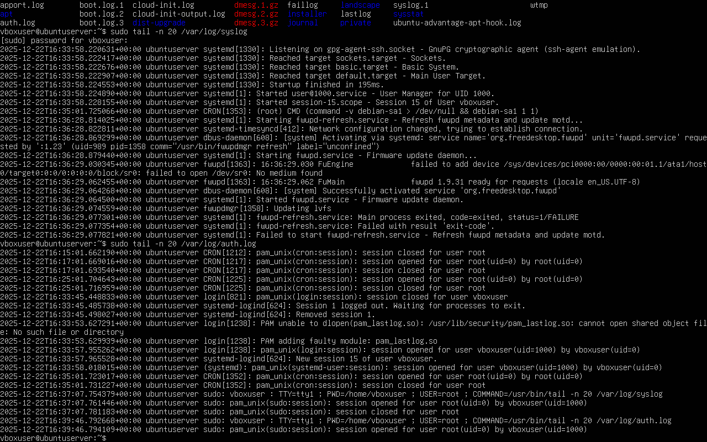
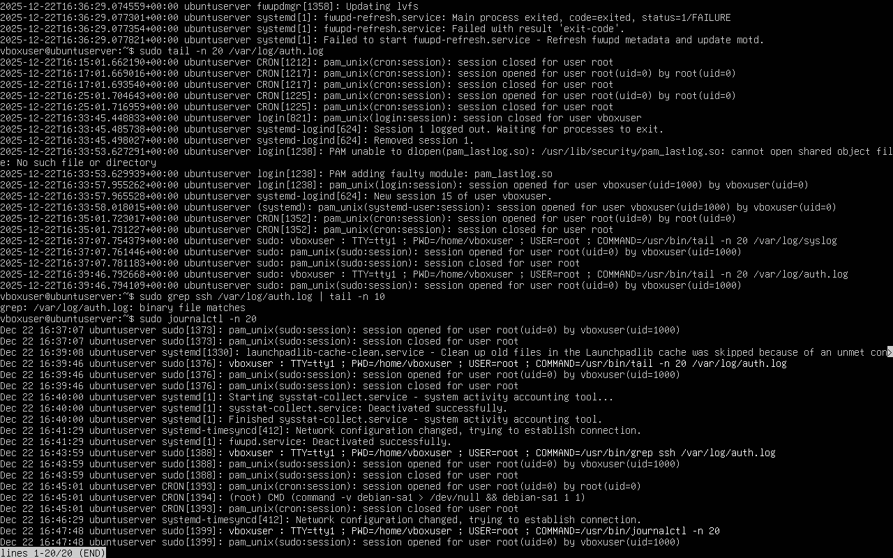

# Phase 6: Performance Evaluation and Analysis (Week 6)

**Module:** CMPN202 Operating Systems
**Student Name:** Niraj Kumar Sah
**Student ID:** A00023606

## Objective:
The aim of this phase was to evaluate system performance and analyse system activity using Linux logging and monitoring tools. This involved examining system logs, authentication records, SSH activity, and the systemd journal to verify that monitoring and logging mechanisms are functioning correctly.

All tasks were completed on the Ubuntu Server virtual machine.

---

## Task 1: Explore System Log Directory:

 Command Used:

ls /var/log

## Explanation:

The /var/log directory stores log files generated by the operating system and system services. Listing this directory confirms that logging is enabled and allows identification of key log files such as syslog, auth.log, and package management logs.

This demonstrates understanding of standard Linux logging structures used for performance monitoring and troubleshooting.

### Evidence:

# Task 2: Review Recent System Log Entries:

Command Used

sudo tail -n 20 /var/log/syslog

## Explanation:

The syslog file records general system activity, including service events and background processes. Reviewing recent entries helps evaluate current system behaviour and identify any warnings or errors that could affect performance.

This confirms that system activity is being logged correctly.

### Evidence:

# Task 3: Analyse Authentication Logs:

Command Used

sudo tail -n 20 /var/log/auth.log

## Explanation:

The authentication log records security-related events such as user logins, SSH access, and sudo commands. Analysing this log supports performance and security evaluation by tracking user activity and access patterns.

This demonstrates effective monitoring of authentication events.

### Evidence

# Task 4: Search Logs for SSH Activity:

Command Used

sudo grep ssh /var/log/auth.log | tail -n 10

## Explanation:

This command filters authentication logs to display recent SSH-related activity only. It helps evaluate remote access usage and ensures SSH sessions are properly recorded for auditing and performance analysis.

This confirms that SSH logging is enabled and functioning.

### Evidence

# Task 5: Verify systemd Journal Logging:

Command Used

sudo journalctl -n 20

## Explanation:

The systemd journal provides centralised logging for system services, applications, and the kernel. Viewing recent journal entries confirms that modern Linux logging mechanisms are active and supports overall performance evaluation and system analysis.

## This demonstrates:

Centralised logging functionality

Active system monitoring

Use of modern Linux performance analysis tools

### Evidence

# Summary

In this phase, system performance and activity were evaluated through comprehensive log analysis. Traditional log files and the systemd journal were reviewed to assess system behaviour, authentication activity, and remote access events. This phase highlights the importance of log management in performance evaluation, troubleshooting, and secure system administration.

