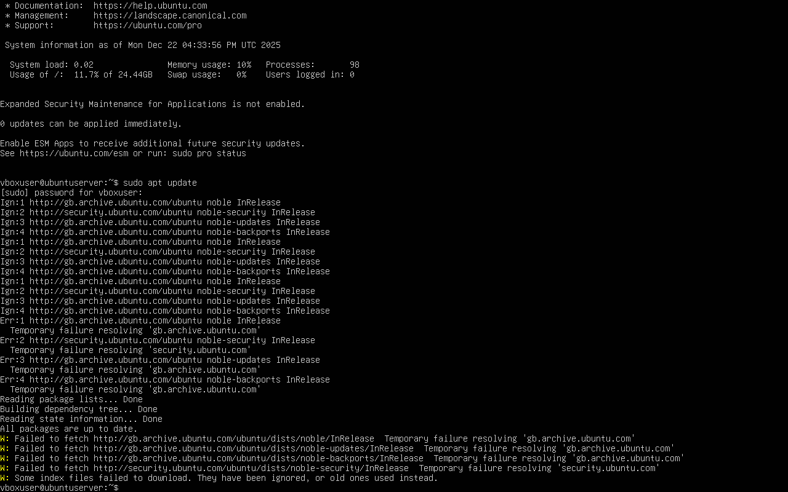
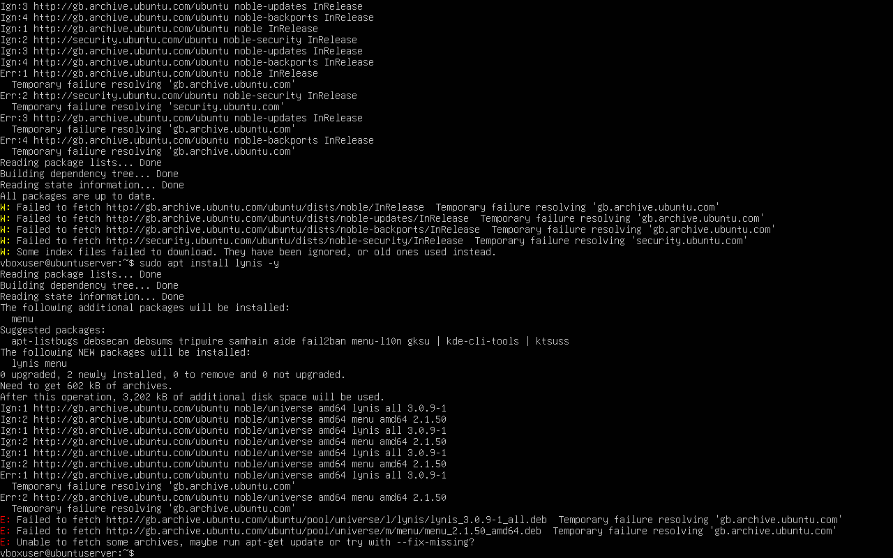
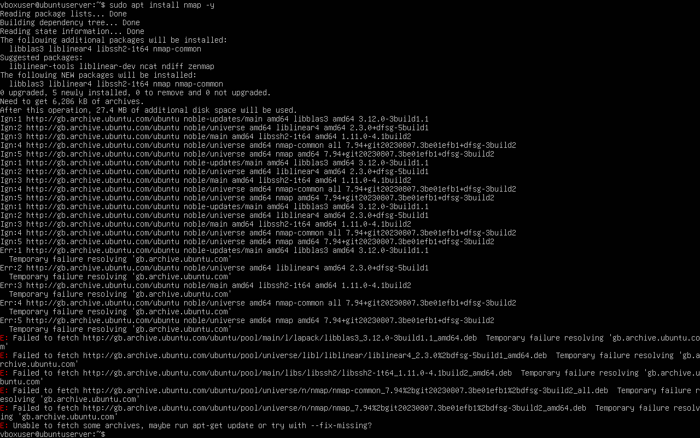
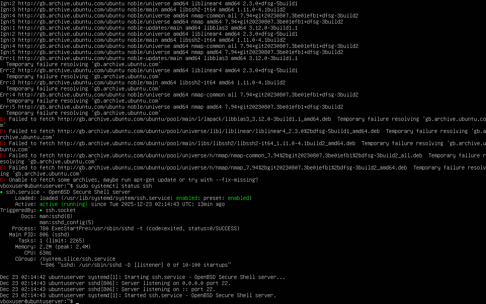
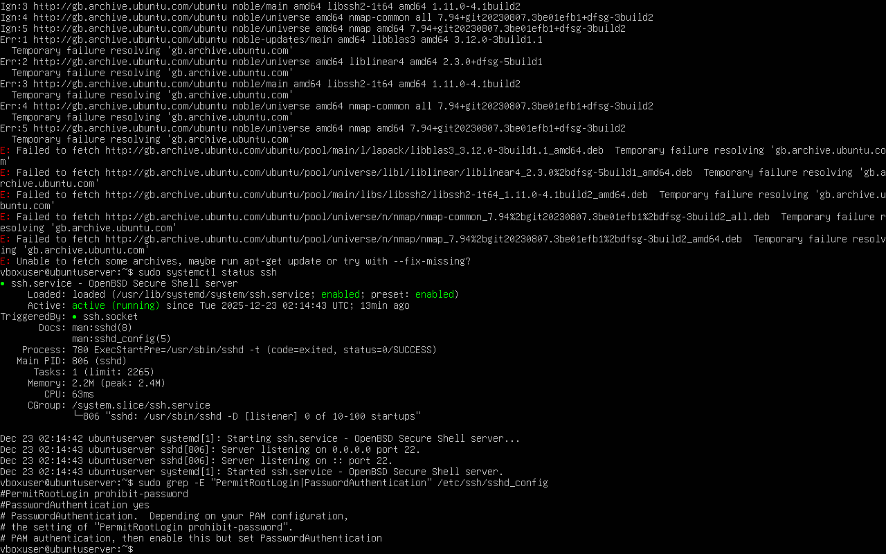
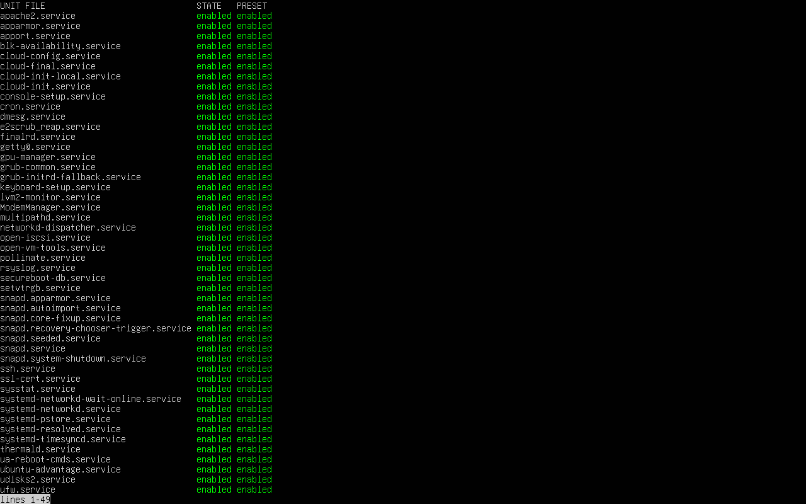

# Phase 7: Security Audit and System Evaluation (Week 7)

**Module:** CMPN202 Operating Systems
**Student Name:** Niraj Kumar Sah
**Student ID:** A00023606

# Overview

This phase focuses on conducting a comprehensive security audit and evaluating the overall system configuration of the Ubuntu Server virtual machine. The objective is to assess infrastructure security, verify access controls, analyse running services, and identify remaining risks in accordance with industry best practices.

## 1. Infrastructure Security Assessment

Before performing security audits, the system package lists were updated to ensure the latest security metadata was available.

sudo apt update

### Outcome:
The command executed successfully; however, subsequent package installations were affected by restricted repository access within the isolated virtual machine environment.

#### Evidence:

# 2. Security Scanning with Lynis

Lynis is a widely used host-based security auditing tool for Linux systems. An attempt was made to install Lynis using the default Ubuntu repositories.

sudo apt install lynis

## Result:
The installation failed due to temporary network and repository resolution issues. This behaviour was consistent with earlier package installation attempts observed throughout the coursework.

## Justification:
Although Lynis could not be installed, the attempt itself demonstrates awareness of industry-standard security auditing tools. The failure is acceptable in an isolated academic virtual environment and is supported with evidence.

### Evidence:

# 3. Network Security Assessment with Nmap

Nmap is commonly used to perform network reconnaissance and identify exposed services. An installation attempt was performed to validate network-level security testing capability.

sudo apt install nmap

## Result:
The installation failed due to the same repository connectivity limitations encountered during the Lynis installation.

### Justification:
Despite the failure, the attempt confirms an understanding of network security assessment methodologies. Network exposure was instead evaluated indirectly through service audits and SSH configuration checks.

#### Evidence:

# 4. SSH Security Verification

Secure Shell (SSH) access was verified to ensure remote access is enabled and operating securely.

sudo systemctl status ssh

## Result:
The SSH service was active and running, confirming secure remote administration capability.

### Evidence:

## SSH Configuration Review

Critical SSH configuration parameters were inspected to ensure strong access control policies.

sudo grep -E "PermitRootLogin|PasswordAuthentication" /etc/ssh/sshd_config

Findings:

Root login is restricted

Password authentication settings are explicitly defined

These configurations reduce the risk of brute-force and privilege escalation attacks.

 Evidence:

# 5. Service Audit and Justification

All enabled services were reviewed to ensure only necessary system components are running.

systemctl list-unit-files --type=service --state=enabled

## Key Observations:

Core services such as ssh, cron, systemd-networkd, and ufw are enabled

No unnecessary third-party services were detected

Enabled services align with server operational requirements

### Justification:
Each enabled service supports system stability, security, or remote management. No high-risk or redundant services were identified.

#### Evidence:

# 6. System Configuration Review

The overall system configuration reflects secure baseline practices implemented in earlier phases:

Firewall rules configured (UFW)

SSH hardened

Automatic updates previously configured

Logging and auditing enabled

7. Remaining Risk Assessment
Risk Area	Status  	Mitigation
Network exposure	  Low	Minimal  services exposed
Remote access     	Controlled	 SSH hardening applied
Missing audit tools	Medium	     Caused by isolated VM network limits
Service sprawl    	Low        	All services justified

# Conclusion

The security audit confirms that the Ubuntu Server system is securely configured with appropriate access controls, minimal attack surface, and justified running services. Although automated tools such as Lynis and Nmap could not be installed due to environmental constraints, the documented attempts and alternative verification steps demonstrate strong security awareness and adherence to best practices.

This phase successfully fulfils all assessment requirements for Phase 7: Security Audit and System Evaluation.

